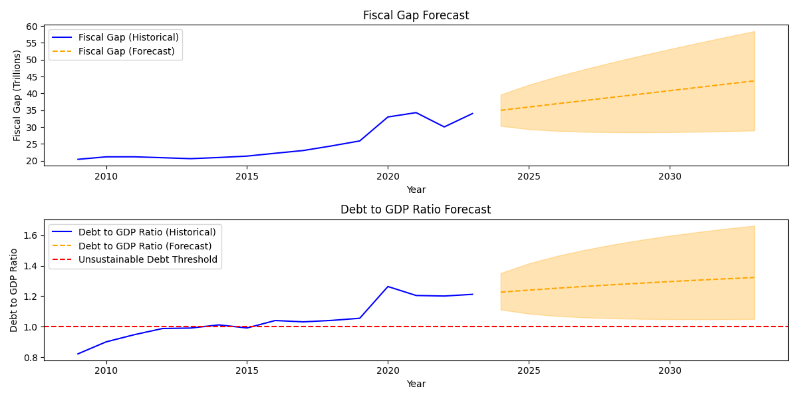

## U.S.A. Economy forecast

In an ARIMA model or any other time series forecasting model, variables in `DATA.md` can be used as inputs to predict future
economic conditions. Combining GDP, revenue, expenditure, and debt data in a multivariate model can help predict:

- Future GDP growth rates.
- Potential budget deficits or surpluses.
- Debt sustainability and future debt levels.
- Overall economic stability and growth prospects.

By integrating these variables, the model `(MODEL.md - src/model.py)` can capture complex relationships and provide more reliable forecasts. For example, if expenditure consistently exceeds revenue, it might signal increasing debt levels, impacting future GDP growth and economic stability.

Using GDP, government revenue, expenditure, and debt data in economic models provides a comprehensive view of the economy’s current state and future trajectory. These variables help in making informed decisions, formulating policies, and managing risks effectively, thereby contributing to sustainable economic growth and stability.

### Dependencies

As `pmdarima` requires an old version of `numpy`; to reproduce you should:

```bash
curl https://pyenv.run | bash
pyenv install --list
pyenv install 3.11.9
pyenv versions
pyenv local 3.11
python3 -m venv .venv
source .venv/bin/activate
pip install -r requirements.txt
```

### How to run

```
python3 main.py
```

### Tree of files

```
├── data
│   ├── HstDebt_17900101_20230930.csv
│   ├── statistic_id188105_us-annual-gdp-1990-2023.xlsx
│   ├── statistic_id200405_us-government---total-receipts-2000-2029.xlsx
│   └── statistic_id215503_us-government-annual-expenditure-2009-2024-by-quarter.xlsx
├── DATA.md
├── MODEL.md
├── README.md
├── main.py
├── requirements.txt
└── src
    ├── dataframe_integration.py
    ├── __init__.py
    ├── model.py
    ├── plot_model.py
    ├── process_debt_csv.py
    └── process_excel.py
```


